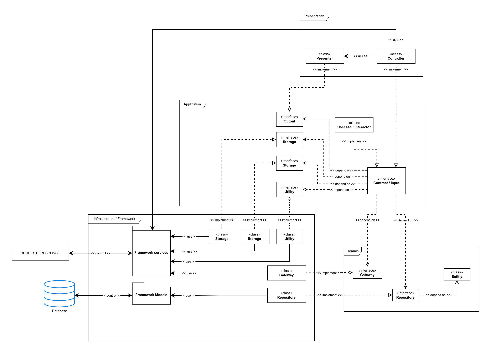

# Architecture Information

---

**NOTE:** This application does not follow the standard Laravel directory structure. Instead, it is split into two main parts: **Features**, which contains every individual feature of the application, and the **Shared** directory, which holds anything shared between multiple features.

The application uses **Clean Architecture**, and its business logic is completely isolated from the framework.

There are unit tests for all feature use cases, testing each response for every scenario within each use case.


## Architecture Idea 

I follow the concepts of **Clean Architecture** as mentioned in [*Clean Architecture* by "Uncle Bob" (Robert C. Martin)](https://blog.cleancoder.com/uncle-bob/2012/08/13/the-clean-architecture.html)  as closely as possible.


## Behaviour Sample 



- **Notice that the dependency direction flows inward; the Domain and Application layers, which hold the business logic, are completely isolated from the framework.**


## Application Structure

- ***Features*** directory structure
```
./app/Features/
├── AppInfos
│   ├── Application
│   │   ├── Contracts
│   │   ├── Ouptputs
│   │   └── Usecases
│   ├── Infrastructure
│   │   └── Providers
│   └── Presentation
│       └── API
│           ├── Controllers
│           └── Presenter
├── Categories
│   ├── Application
│   │   ├── Contracts
│   │   ├── Outputs
│   │   └── Usecases
│   ├── Infrastructure
│   │   └── Providers
│   └── Presentation
│       └── API
│           ├── Controllers
│           ├── Presenters
│           └── Requests
├── Documents
│   ├── Application
│   │   ├── Contracts
│   │   ├── DTOs
│   │   ├── Outputs
│   │   └── Usecases
│   ├── Infrastructure
│   │   ├── Providers
│   │   └── Validation
│   │       └── Rules
│   └── Presentation
│       └── API
│           ├── Controllers
│           ├── Presenters
│           └── Requests
├── Groups
│   ├── Application
│   │   ├── Contracts
│   │   ├── Outputs
│   │   └── Usecases
│   ├── Infrastructure
│   │   └── Providers
│   └── Presentation
│       └── API
│           ├── Controllers
│           ├── Presenters
│           └── Requests
├── Permissions
│   ├── Application
│   │   ├── Contracts
│   │   ├── Outputs
│   │   └── Usecases
│   ├── Infrastructure
│   │   └── Providers
│   └── Presentation
│       └── API
│           ├── Controllers
│           └── Presenters
└── Users
    ├── Application
    │   ├── Contracts
    │   ├── Outputs
    │   └── Usecases
    ├── Infrastructure
    │   └── Providers
    └── Presentation
        ├── API
        │   ├── Controllers
        │   ├── Presenters
        │   └── Requests
        └── Console
            └── Commands
```

- ***Shared*** directory structure

```
./app/Shared/
├── Application
│   ├── Contracts
│   │   ├── Security
│   │   ├── Storage
│   │   └── Utilities
│   └── Utilities
├── Domain
│   ├── Contracts
│   ├── Entities
│   │   ├── AppInfo
│   │   ├── Document
│   │   ├── Group
│   │   ├── Setting
│   │   └── User
│   ├── Enums
│   │   ├── Document
│   │   └── User
│   ├── Gateways
│   ├── Repositories
│   └── ValuObjects
├── Infrastructure
│   ├── Constants
│   ├── Gateways
│   ├── Models
│   ├── Providers
│   ├── Repositories
│   │   └── Eloquent
│   │       └── Traits
│   ├── Security
│   ├── Storage
│   └── Utilities
└── Presentation
    ├── API
    │   └── Traits
    └── HTTP
```
